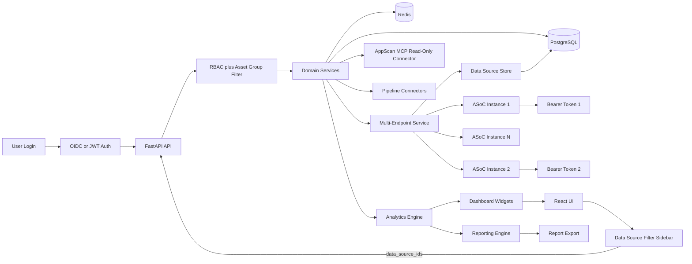
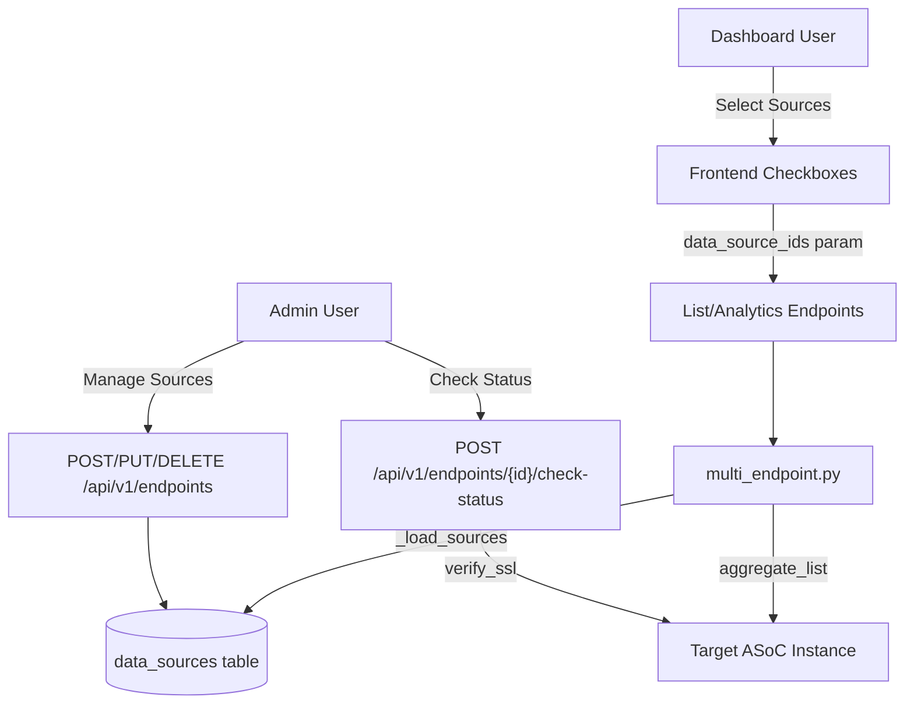
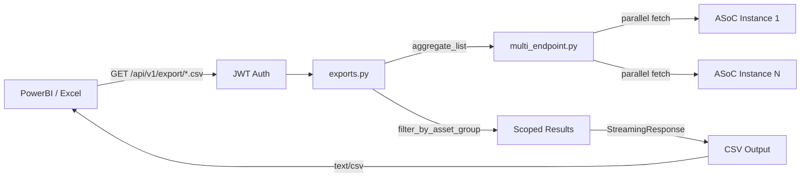
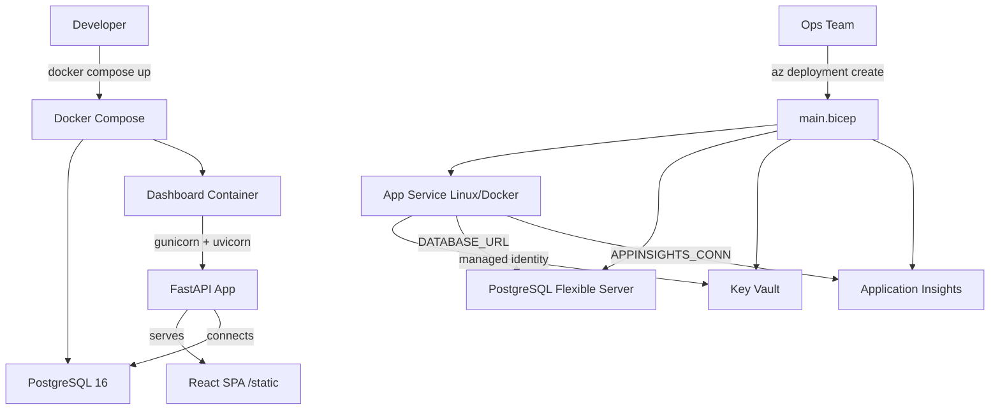
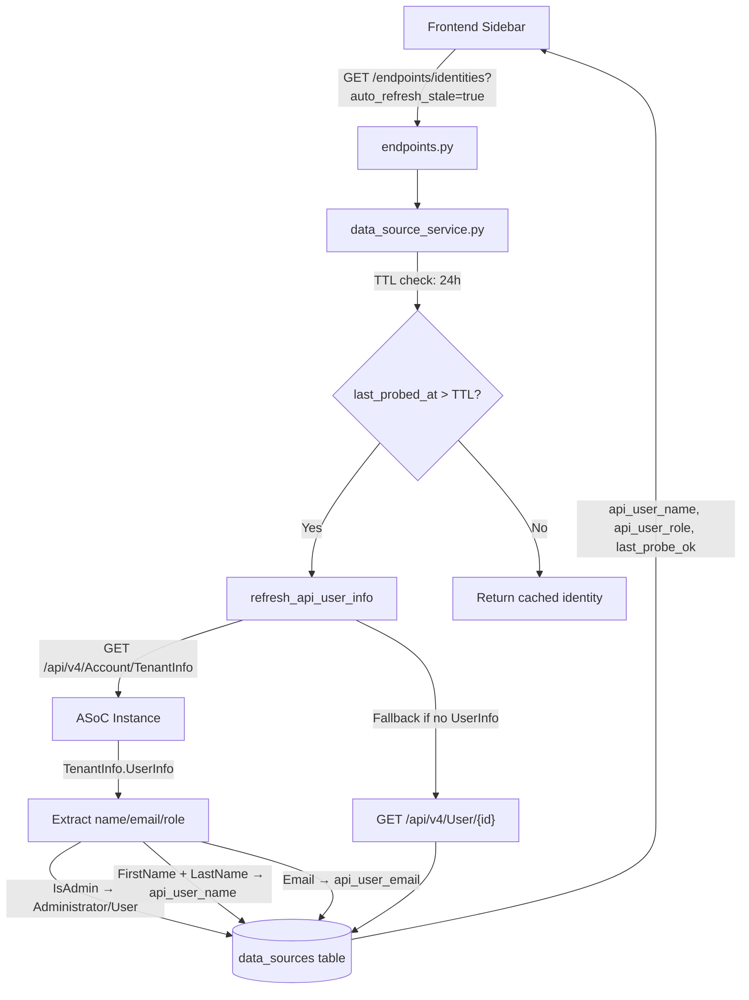

# Workflow Diagram

```mermaid
flowchart LR
A[User Login] --> B[OIDC or JWT Auth]
B --> C[FastAPI API]
C --> D[RBAC plus Asset Group Filter]
D --> E[Domain Services]
E --> F[(PostgreSQL)]
E --> G[(Redis)]
E --> DS[Multi-Endpoint Service]
DS --> DS1[Data Source Store]
DS1 --> F
DS --> H1a[ASoC Instance 1]
DS --> H1b[ASoC Instance 2]
DS --> H1c[ASoC Instance N]
H1a --> H2a[Bearer Token 1]
H1b --> H2b[Bearer Token 2]
E --> I[AppScan MCP Read-Only Connector]
E --> J[Pipeline Connectors]
E --> K[Analytics Engine]
K --> L[Dashboard Widgets]
K --> M[Reporting Engine]
L --> N[React UI]
N --> DSFilter[Data Source Filter Sidebar]
DSFilter -->|data_source_ids| C
M --> O[Report Export]
```

## Data Source Management Flow

```mermaid
flowchart TD
Admin[Admin User] -->|Manage Sources| EP["POST/PUT/DELETE /api/v1/endpoints"]
EP --> DSStore[(data_sources table)]
Admin -->|Check Status| Probe["POST /api/v1/endpoints/{id}/check-status"]
Probe -->|verify_ssl| ASoC[Target ASoC Instance]
User[Dashboard User] -->|Select Sources| UI[Frontend Checkboxes]
UI -->|data_source_ids param| API[List/Analytics Endpoints]
API --> Multi[multi_endpoint.py]
Multi -->|_load_sources| DSStore
Multi -->|aggregate_list| ASoC
```
## CSV Export Flow (v1.5e)

```mermaid
flowchart LR
BI[PowerBI / Excel] -->|GET /api/v1/export/*.csv| Auth[JWT Auth]
Auth --> Export[exports.py]
Export -->|aggregate_list| Multi[multi_endpoint.py]
Multi -->|parallel fetch| ASoC1[ASoC Instance 1]
Multi -->|parallel fetch| ASoC2[ASoC Instance N]
Export -->|filter_by_asset_group| Scoped[Scoped Results]
Scoped -->|StreamingResponse| CSV[CSV Output]
CSV -->|text/csv| BI
```

## Docker / Azure Deployment Flow (v1.5e)

```mermaid
flowchart TD
Dev[Developer] -->|docker compose up| Compose[Docker Compose]
Compose --> PG[PostgreSQL 16]
Compose --> App[Dashboard Container]
App -->|gunicorn + uvicorn| FastAPI[FastAPI App]
FastAPI -->|serves| Static[React SPA /static]
FastAPI -->|connects| PG

Ops[Ops Team] -->|az deployment create| Bicep[main.bicep]
Bicep --> AS[App Service Linux/Docker]
Bicep --> PGFS[PostgreSQL Flexible Server]
Bicep --> KV[Key Vault]
Bicep --> AI[Application Insights]
AS -->|managed identity| KV
AS -->|DATABASE_URL| PGFS
AS -->|APPINSIGHTS_CONN| AI
```

## Identity Probe Flow

```mermaid
flowchart TD
FE[Frontend Sidebar] -->|GET /endpoints/identities?auto_refresh_stale=true| Routes[endpoints.py]
Routes --> Svc[data_source_service.py]
Svc -->|TTL check: 24h| Stale{last_probed_at > TTL?}
Stale -->|Yes| Refresh[refresh_api_user_info]
Stale -->|No| Skip[Return cached identity]
Refresh -->|GET /api/v4/Account/TenantInfo| ASoC[ASoC Instance]
ASoC -->|TenantInfo.UserInfo| Extract[Extract name/email/role]
Extract -->|IsAdmin → Administrator/User| DB[(data_sources table)]
Extract -->|FirstName + LastName → api_user_name| DB
Extract -->|Email → api_user_email| DB
Refresh -->|Fallback if no UserInfo| UserEP["GET /api/v4/User/{id}"]
UserEP --> DB
DB -->|api_user_name, api_user_role, last_probe_ok| FE
```