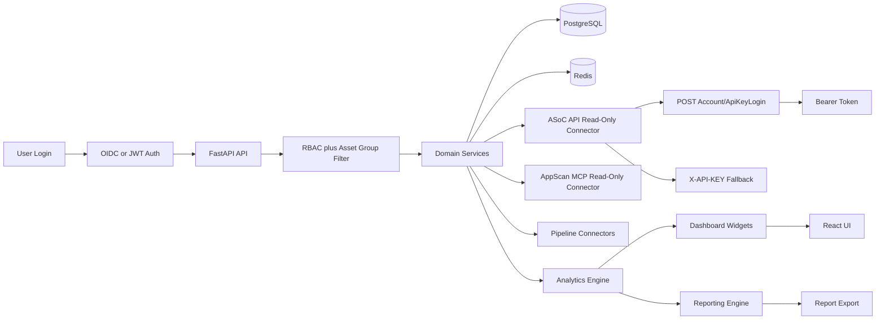

# Workflow Diagram

```mermaid
flowchart LR
A[User Login] --> B[OIDC or JWT Auth]
B --> C[FastAPI API]
C --> D[RBAC plus Asset Group Filter]
D --> E[Domain Services]
E --> F[(PostgreSQL)]
E --> G[(Redis)]
E --> H[ASoC API Read-Only Connector]
H --> H1[POST Account/ApiKeyLogin]
H1 --> H2[Bearer Token]
H --> H3[X-API-KEY Fallback]
E --> I[AppScan MCP Read-Only Connector]
E --> J[Pipeline Connectors]
E --> K[Analytics Engine]
K --> L[Dashboard Widgets]
K --> M[Reporting Engine]
L --> N[React UI]
M --> O[Report Export]
```
