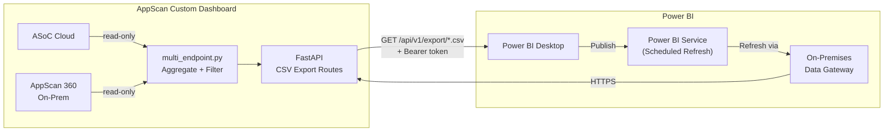
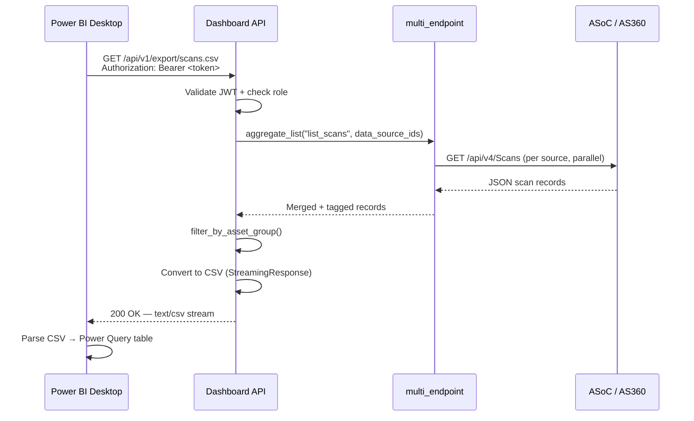
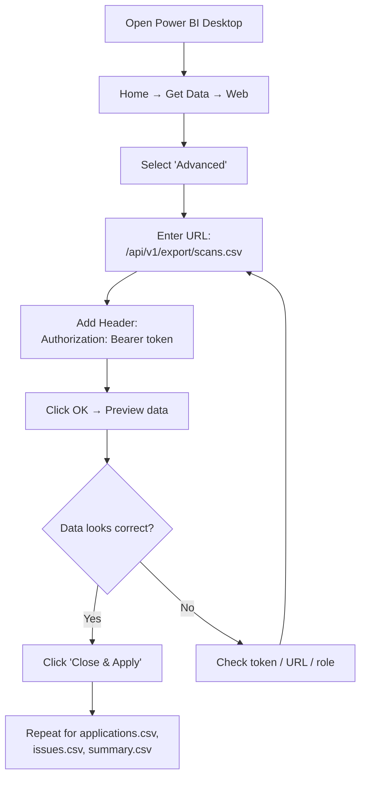
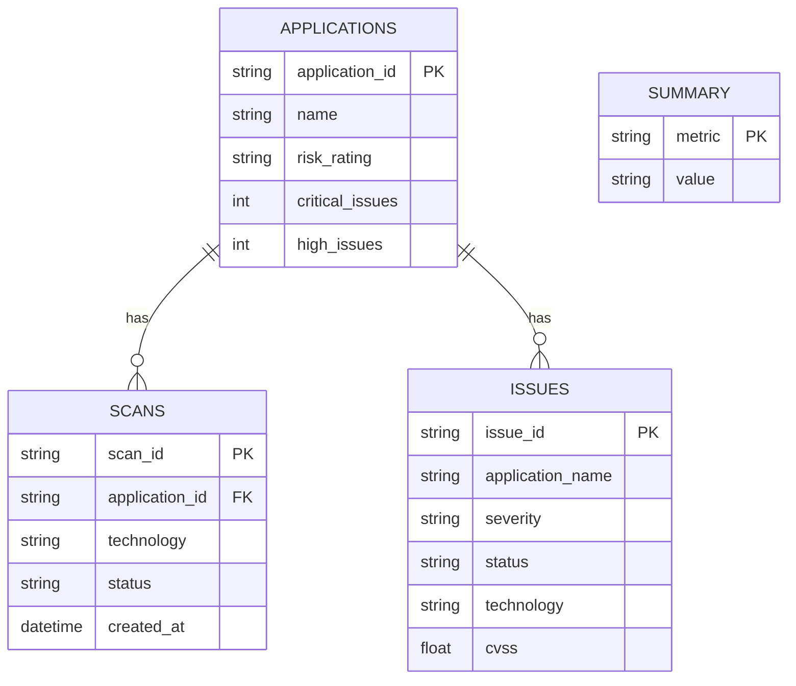
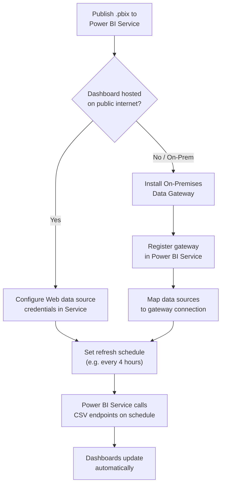
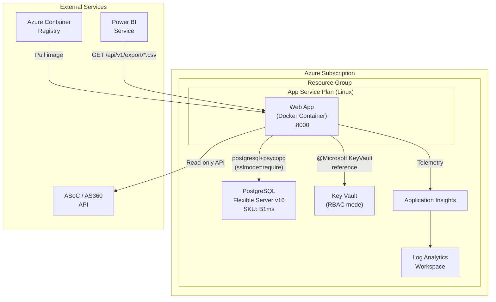
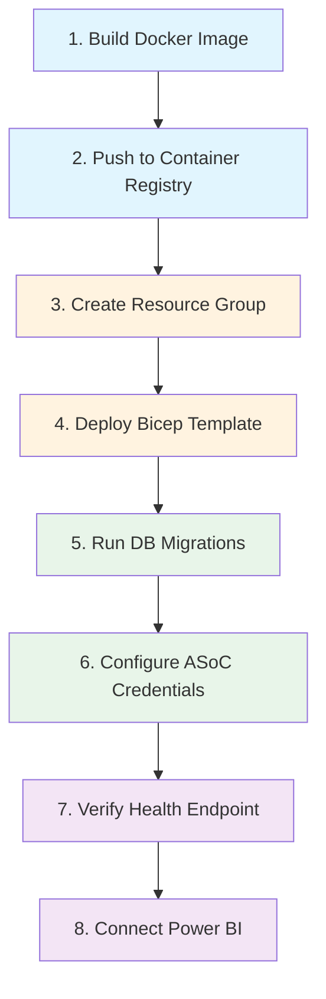
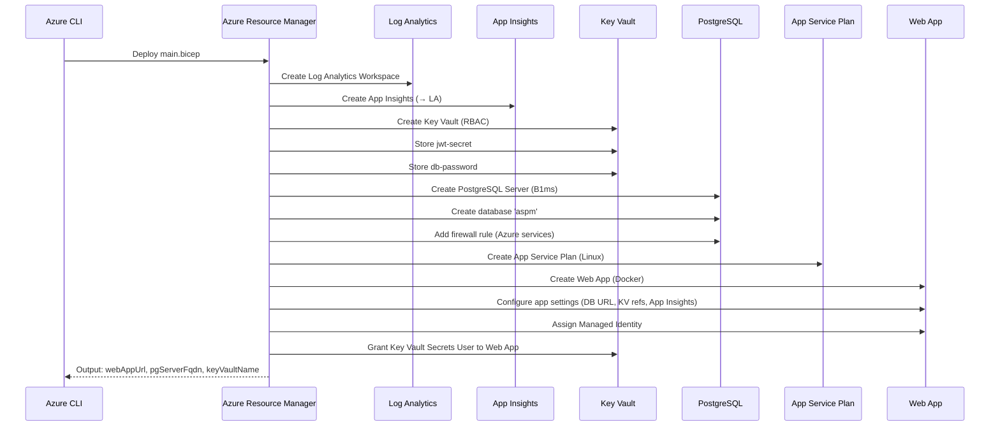
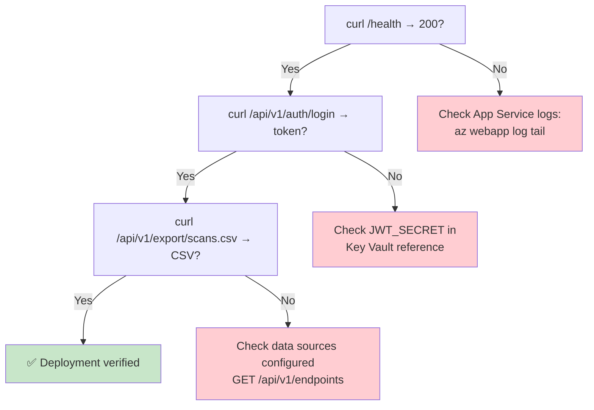
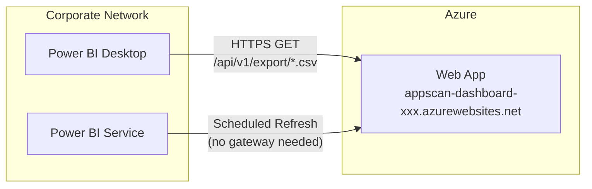

# Power BI Integration & Azure Deployment Guide

**Version**: 1.5e | **Last updated**: 2026-04-17

---

## Table of Contents

1. [Power BI Integration](#1-power-bi-integration)
   - [Architecture Overview](#11-architecture-overview)
   - [Available CSV Export Endpoints](#12-available-csv-export-endpoints)
   - [Step-by-Step: Connect Power BI to the Dashboard](#13-step-by-step-connect-power-bi-to-the-dashboard)
   - [Building Dashboards in Power BI](#14-building-dashboards-in-power-bi)
   - [Scheduled Refresh](#15-scheduled-refresh)
2. [Azure Deployment](#2-azure-deployment)
   - [Deployment Architecture](#21-deployment-architecture)
   - [Prerequisites](#22-prerequisites)
   - [Step-by-Step Deployment](#23-step-by-step-deployment)
   - [Post-Deployment Verification](#24-post-deployment-verification)
   - [Connecting Power BI to the Azure-Hosted Dashboard](#25-connecting-power-bi-to-the-azure-hosted-dashboard)
3. [Appendix](#3-appendix)

---

## 1. Power BI Integration

### 1.1 Architecture Overview

The dashboard exposes four streaming CSV endpoints that Power BI Desktop (or Excel) can consume directly via HTTP. All endpoints enforce JWT authentication and role-based asset-group scoping.



**Data Flow**:



### 1.2 Available CSV Export Endpoints

| Endpoint | Description | Key Columns |
|---|---|---|
| `GET /api/v1/export/scans.csv` | All scans with severity counts | Scan ID, Name, Technology, Status, Duration, Data Source |
| `GET /api/v1/export/applications.csv` | Applications with risk rating | App ID, Name, Risk Rating, Critical/High/Med/Low, Data Source |
| `GET /api/v1/export/issues.csv` | All issues with CWE and location | Issue ID, Severity, Status, CVE, CVSS, Location, Data Source |
| `GET /api/v1/export/summary.csv` | KPI pivot table + Top 20 apps | Metric/Value rows, then App/Critical/High/Med/Low/Total |

**Common Query Parameters**:

| Parameter | Type | Description |
|---|---|---|
| `data_source_ids` | `string[]` (query, repeatable) | Filter to specific data sources. Omit for all enabled sources. Max 20. |

**Authentication**: All endpoints require `Authorization: Bearer <JWT token>` header.

### 1.3 Step-by-Step: Connect Power BI to the Dashboard

#### Step 1 — Obtain a JWT Token

```bash
# Login to the dashboard API
curl -s -X POST http://<dashboard-host>:8000/api/v1/auth/login \
  -H "Content-Type: application/json" \
  -d '{"username": "<user>", "password": "<pass>"}' \
  | python3 -c "import sys,json; print(json.load(sys.stdin)['access_token'])"
```

Save the returned token — you'll use it in Power BI.

#### Step 2 — Add a Web Data Source in Power BI Desktop

1. Open **Power BI Desktop** → **Home** → **Get Data** → **Web**.
2. Select **Advanced**.
3. Configure:

| Field | Value |
|---|---|
| **URL** | `http://<dashboard-host>:8000/api/v1/export/scans.csv` |
| **HTTP request header** (name) | `Authorization` |
| **HTTP request header** (value) | `Bearer <your-jwt-token>` |

4. Click **OK** → Power Query Editor opens with the CSV data.



#### Step 3 — Repeat for Each Endpoint

Add separate Web data sources for each CSV:

| Query Name | URL |
|---|---|
| `Scans` | `/api/v1/export/scans.csv` |
| `Applications` | `/api/v1/export/applications.csv` |
| `Issues` | `/api/v1/export/issues.csv` |
| `Summary` | `/api/v1/export/summary.csv` |

#### Step 4 — Data Transformations (Power Query)

In the Power Query Editor, apply these transformations:

- **Scans**: Change `Duration (s)` to Whole Number, `Created At` to DateTime.
- **Applications**: Change severity count columns to Whole Number.
- **Issues**: Change `CVSS` to Decimal Number, `Date Created` / `Last Updated` to DateTime.
- **Summary**: Split into two queries — filter rows where Metric ≠ empty for KPIs, create a separate reference query for the Top 20 apps table (starts after the blank row).

### 1.4 Building Dashboards in Power BI

#### Recommended Visuals

| Visual | Data Source | Fields |
|---|---|---|
| **KPI Card** — Total Issues | Summary | Metric = "Total Issues", Value |
| **KPI Card** — Critical Issues | Summary | Metric = "Critical", Value |
| **Donut Chart** — Issues by Severity | Issues | Severity (Legend), Count of Issue ID (Values) |
| **Stacked Bar** — Issues by Technology | Issues | Technology (Axis), Count of Issue ID (Values), Severity (Legend) |
| **Table** — Top Risky Apps | Applications | Name, Risk Rating, Critical, High, Medium, Low |
| **Line Chart** — Scan Activity | Scans | Created At (Axis), Count of Scan ID (Values), Technology (Legend) |
| **Matrix** — Issues by App × Severity | Issues | Application (Rows), Severity (Columns), Count (Values) |

#### Data Model Relationships



Set up relationships in Power BI:
- `Scans[Application ID]` → `Applications[Application ID]`
- `Issues[Application]` → `Applications[Application Name]`

### 1.5 Scheduled Refresh

For automatic data refresh in Power BI Service:



**Token Refresh Consideration**: JWT tokens expire. For automated refresh:
- Use a service account with a long-lived token, or
- Set up a Power Automate flow that refreshes the token before each scheduled data refresh.

---

## 2. Azure Deployment

### 2.1 Deployment Architecture

The Bicep template (`infra/azure/main.bicep`) deploys a complete production stack:



**Resources Created**:

| Resource | SKU / Config | Purpose |
|---|---|---|
| App Service Plan | Linux, B1 (configurable) | Compute for Docker container |
| Web App | Docker, HTTPS-only, TLS 1.2 | Dashboard application |
| PostgreSQL Flexible Server | B1ms, v16, 32 GB storage | Application database |
| Key Vault | Standard, RBAC, soft delete | Secrets (JWT secret, DB password) |
| Application Insights | Web type | APM and telemetry |
| Log Analytics Workspace | PerGB2018, 30-day retention | Centralized logging |

### 2.2 Prerequisites

| Requirement | How to Check |
|---|---|
| Azure CLI installed | `az version` |
| Logged in to Azure | `az account show` |
| Resource group created | `az group list -o table` |
| Docker image pushed to registry | `az acr repository show-tags --name <registry> --repository appscan-dashboard` |
| Bicep CLI available | `az bicep version` |

### 2.3 Step-by-Step Deployment



#### Step 1 — Build the Docker Image

```bash
# From the project root
docker build -f infra/docker/Dockerfile -t appscan-dashboard:latest .
```

#### Step 2 — Push to Azure Container Registry

```bash
# Create ACR (once)
az acr create --resource-group <rg-name> --name <acrname> --sku Basic

# Login to ACR
az acr login --name <acrname>

# Tag and push
docker tag appscan-dashboard:latest <acrname>.azurecr.io/appscan-dashboard:latest
docker push <acrname>.azurecr.io/appscan-dashboard:latest
```

#### Step 3 — Create Resource Group (if needed)

```bash
az group create --name appscan-dashboard-rg --location eastus
```

#### Step 4 — Deploy the Bicep Template

```bash
az deployment group create \
  --resource-group appscan-dashboard-rg \
  --template-file infra/azure/main.bicep \
  --parameters infra/azure/main.parameters.json \
  --parameters \
    baseName=appscan-dashboard \
    dbAdminPassword='<secure-password-here>' \
    jwtSecret='<random-64-char-secret>' \
    imageTag=latest \
    appServiceSku=B1
```

**What this deploys**:



#### Step 5 — Run Database Migrations

```bash
# Get the Web App name from deployment output
WEB_APP=$(az deployment group show \
  --resource-group appscan-dashboard-rg \
  --name main \
  --query properties.outputs.webAppName.value -o tsv)

# SSH into the container and run migrations
az webapp ssh --resource-group appscan-dashboard-rg --name $WEB_APP

# Inside the container:
alembic upgrade head
exit
```

#### Step 6 — Configure ASoC Data Sources

After the app is running, add data sources via the dashboard UI or API:

```bash
DASHBOARD_URL=$(az deployment group show \
  --resource-group appscan-dashboard-rg \
  --name main \
  --query properties.outputs.webAppUrl.value -o tsv)

# Login
TOKEN=$(curl -s -X POST "$DASHBOARD_URL/api/v1/auth/login" \
  -H "Content-Type: application/json" \
  -d '{"username": "admin", "password": "<password>"}' \
  | python3 -c "import sys,json; print(json.load(sys.stdin)['access_token'])")

# Add a data source
curl -X POST "$DASHBOARD_URL/api/v1/endpoints" \
  -H "Authorization: Bearer $TOKEN" \
  -H "Content-Type: application/json" \
  -d '{
    "label": "ASoC Cloud",
    "service_url": "https://cloud.appscan.com",
    "api_key_id": "<key>",
    "api_key_secret": "<secret>",
    "verify_ssl": true
  }'
```

#### Step 7 — Verify Health

```bash
curl "$DASHBOARD_URL/health"
# Expected: {"status": "ok"}
```

### 2.4 Post-Deployment Verification



**Checklist**:

| # | Check | Command | Expected |
|---|---|---|---|
| 1 | Health endpoint | `curl $URL/health` | `{"status": "ok"}` |
| 2 | Login works | `POST /api/v1/auth/login` | JWT token returned |
| 3 | Data sources | `GET /api/v1/endpoints` | At least one source |
| 4 | Connection status | `GET /api/v1/endpoints/status` | `reachable: true` |
| 5 | CSV export | `GET /api/v1/export/scans.csv` | CSV with headers + rows |
| 6 | App Insights | Azure Portal → App Insights | Requests appearing |

### 2.5 Connecting Power BI to the Azure-Hosted Dashboard

Once deployed to Azure, the CSV endpoints are available over HTTPS:



**Key difference from on-premises**: Because the dashboard is publicly accessible on `*.azurewebsites.net` over HTTPS, Power BI Service can refresh data **directly without a Data Gateway**.

Power BI configuration is identical to Section 1.3, just replace the URL:
```
https://appscan-dashboard-<suffix>.azurewebsites.net/api/v1/export/scans.csv
```

---

## 3. Appendix

### A. Bicep Template Parameters Reference

| Parameter | Type | Default | Description |
|---|---|---|---|
| `baseName` | string | `appscan-dashboard` | Base name for all resources |
| `location` | string | Resource group location | Azure region |
| `dbAdminLogin` | string | `pgadmin` | PostgreSQL admin username |
| `dbAdminPassword` | secureString | *(required)* | PostgreSQL admin password |
| `jwtSecret` | secureString | *(required)* | JWT signing secret |
| `imageTag` | string | `latest` | Docker image tag |
| `appServiceSku` | string | `B1` | App Service Plan SKU (B1/B2/S1/S2/P1v3/P2v3) |

### B. Bicep Template Outputs

| Output | Description |
|---|---|
| `webAppUrl` | Full URL of the deployed Web App |
| `webAppName` | Web App resource name |
| `pgServerFqdn` | PostgreSQL server FQDN |
| `keyVaultName` | Key Vault resource name |
| `appInsightsName` | Application Insights resource name |

### C. CSV Column Reference

#### scans.csv

| Column | Source Field | Type |
|---|---|---|
| Scan ID | `id` | string |
| Scan Name | `name` | string |
| Technology | `scan_type` | string |
| Status | `status` | string |
| Application ID | `application_id` | string |
| Application Name | `application_name` | string |
| Asset Group ID | `asset_group_id` | string |
| Created At | `created_at` | datetime |
| Duration (s) | `duration_seconds` | integer |
| SAST LOC | `sast_size` | integer |
| SCA Components | `sca_size` | integer |
| Pages Scanned | `page_coverage` | integer |
| Data Source | `_data_source_label` | string |

#### applications.csv

| Column | Source Field | Type |
|---|---|---|
| Application ID | `id` | string |
| Application Name | `name` | string |
| Asset Group ID | `asset_group_id` | string |
| Asset Group | `asset_group_name` | string |
| Risk Rating | `risk_rating` | string |
| Business Impact | `business_impact` | string |
| Total Issues | `total_issues` | integer |
| Critical | `critical_issues` | integer |
| High | `high_issues` | integer |
| Medium | `medium_issues` | integer |
| Low | `low_issues` | integer |
| Open Issues | `open_issues` | integer |
| Total Scans | `total_scans` | integer |
| Testing Status | `testing_status` | string |
| Last Updated | `last_updated` | datetime |
| Data Source | `_data_source_label` | string |

#### issues.csv

| Column | Source Field | Type |
|---|---|---|
| Issue ID | `id` | string |
| Application | `application_name` | string |
| Issue Type | `issue_type` | string |
| Severity | `severity` | string |
| Status | `status` | string |
| Technology | `scanner_type` | string |
| Location | `location` | string |
| API | `api` | string |
| Date Created | `date_created` | datetime |
| Last Updated | `last_updated` | datetime |
| Fix Group ID | `fix_group_id` | string |
| CVE | `cve` | string |
| CVSS | `cvss` | decimal |
| Data Source | `_data_source_label` | string |

#### summary.csv

**Section 1 — KPI Pivot** (rows: Metric / Value):
Total Issues, Active Issues, Resolved Issues, Critical, High, Medium, Low, SAST Issues, DAST Issues, SCA Issues, IAST Issues

**Section 2 — Top 20 Applications** (columns: Application, Critical, High, Medium, Low, Total)

### D. Troubleshooting

| Problem | Cause | Solution |
|---|---|---|
| 401 on CSV endpoint | Expired or invalid JWT | Re-authenticate via `/api/v1/auth/login` |
| Empty CSV (headers only) | No data sources configured | Add sources via `POST /api/v1/endpoints` |
| Timeout on large export | Too many sources / issues | Use `data_source_ids` param to scope |
| Bicep deployment fails | Missing required params | Provide `dbAdminPassword` and `jwtSecret` |
| Container crash loop | DB not reachable | Check PostgreSQL firewall rules and connection string |
| Key Vault reference error | Managed identity not granted access | Verify RBAC role assignment on Key Vault |
