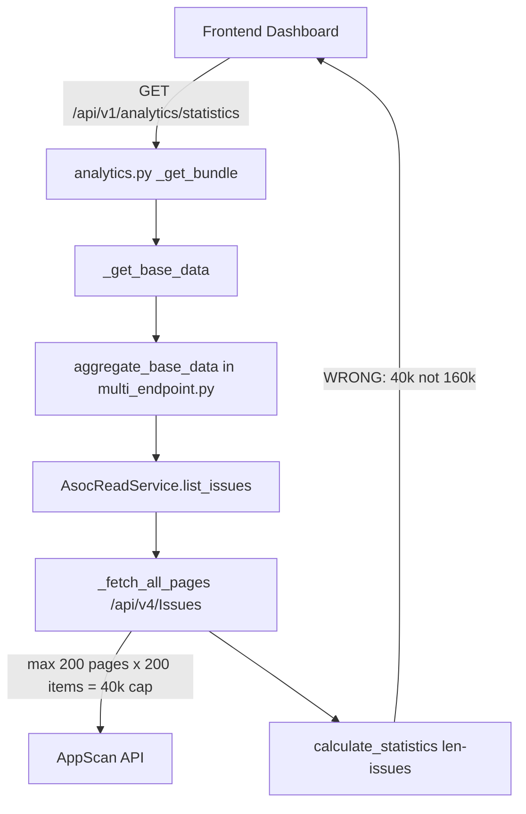
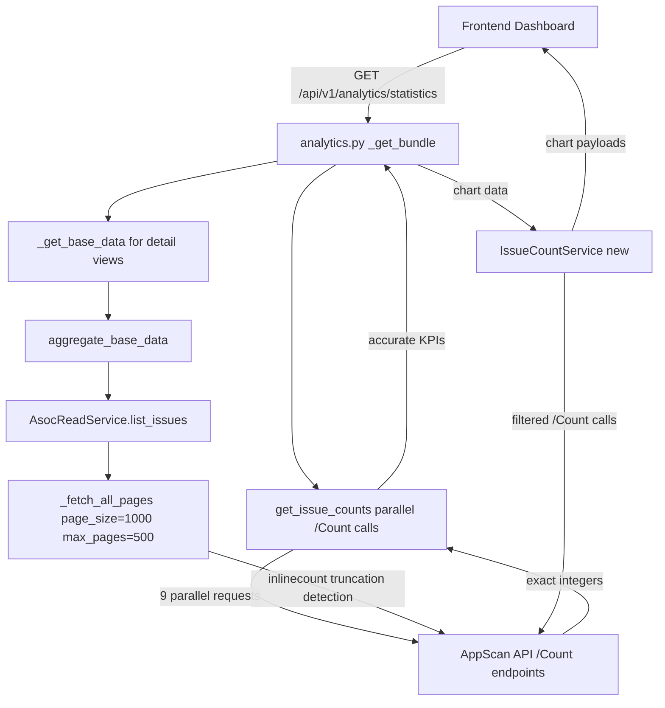

# PLAN: Statistics Fix & Dashboard Chart Enhancement

**Version:** 1.0  
**Date:** 2026-04-09  
**Status:** Draft — Awaiting Approval

---

## Table of Contents

1. [Problem Summary](#1-problem-summary)
2. [Architecture Overview & Data Flow](#2-architecture-overview--data-flow)
3. [Root Cause Analysis](#3-root-cause-analysis)
4. [Backend Changes — File by File](#4-backend-changes--file-by-file)
5. [New API Endpoints](#5-new-api-endpoints)
6. [Frontend Changes — Component Hierarchy](#6-frontend-changes--component-hierarchy)
7. [Migration & Rollback Strategy](#7-migration--rollback-strategy)
8. [Implementation Phases](#8-implementation-phases)

---

## 1. Problem Summary

The ASPM dashboard reports incorrect total issue counts. A tenant with **160,000+ issues** sees at most **~40,000** because:

| Limit | Calculation | Cap |
|---|---|---|
| Org-level pages | `asoc_page_size=200` × `asoc_max_pages=200` | 40,000 items |
| Per-app fallback | `asoc_issue_max_pages_per_app=20` × 200 | 4,000 per app |

`calculate_statistics()` calls `len(issues)` on the truncated list, so every KPI derived from it (critical, high, medium, low, active, resolved) is proportionally wrong.

The AppScan API exposes `/Count` endpoints that return exact integers in a single HTTP request — these are not used anywhere today.

---

## 2. Architecture Overview & Data Flow

### 2a. Current (Broken) Flow



### 2b. Target (Fixed) Flow



### 2c. Count-First Strategy

For **dashboard KPIs** (total, active, critical, high, medium, low, by-technology), use `/Count` endpoints — 9 parallel requests, sub-second response, always accurate.

For **detail views** (issue list, prioritization, trend series, MTTR), continue fetching full pages but with increased limits and truncation detection.

---

## 3. Root Cause Analysis

| File | Location | Bug |
|---|---|---|
| [`settings.py`](../backend/app/core/config/settings.py:42) | `asoc_page_size = 200` | API max is 1,000; using 200 wastes 5× the requests |
| [`settings.py`](../backend/app/core/config/settings.py:43) | `asoc_max_pages = 200` | 200 × 200 = 40,000 hard cap |
| [`asoc_read_service.py`](../backend/app/services/asoc_read_service.py:1022) | `_fetch_all_pages()` | No `$inlinecount` — cannot detect truncation |
| [`asoc_read_service.py`](../backend/app/services/asoc_read_service.py:1564) | `calculate_statistics()` | Uses `len(issues)` on truncated list |
| [`asoc_read_service.py`](../backend/app/services/asoc_read_service.py:1557) | `build_portfolio_summary()` | `total_issues: len(issues)` — same truncation |
| [`multi_endpoint.py`](../backend/app/services/multi_endpoint.py:127) | `aggregate_base_data()` | Calls `list_issues()` which hits the page cap |
| [`analytics.py`](../backend/app/api/v1/routes/analytics.py:1450) | `_build_bundle()` | Passes truncated `issues` list to all calculators |

---

## 4. Backend Changes — File by File

### 4.1 `backend/app/core/config/settings.py`

**Changes:**

```python
# BEFORE
asoc_page_size: int = 200
asoc_max_pages: int = 200
asoc_issue_max_pages_per_app: int = 20

# AFTER
asoc_page_size: int = 1000          # API maximum; 5× fewer requests
asoc_max_pages: int = 500           # covers 500,000 items
asoc_issue_max_pages_per_app: int = 100  # covers 100,000 per app
```

**New settings to add:**

```python
# Count-first strategy
asoc_count_concurrency: int = 9     # parallel /Count requests
asoc_count_timeout_seconds: float = 10.0

# Chart data
asoc_top_apps_chart_limit: int = 20  # top-N apps in bar chart
```

**Contract:** All existing callers of `settings.asoc_page_size` and `settings.asoc_max_pages` automatically benefit — no interface change.

---

### 4.2 `backend/app/integrations/appscan_api/client.py`

**Changes:**

The `get()` method returns `dict[str, Any]`. The `/Count` endpoints return a plain integer, not a JSON object. Add a new method:

```python
async def get_count(self, path: str, params: dict[str, Any] | None = None) -> int:
    """Call a /Count endpoint and return the integer result.

    AppScan /Count endpoints return a bare integer (not a JSON object).
    This method handles the integer response and falls back to 0 on error.
    """
    self._validate_request("GET", path)
    headers = await self._get_auth_header()
    async with httpx.AsyncClient(base_url=self.base_url, timeout=20.0) as client:
        resp = await client.get(path, params=params, headers=headers)
        # ... auth retry logic (same as get()) ...
        resp.raise_for_status()
        body = resp.text.strip()
        try:
            return int(body)
        except ValueError:
            # Some endpoints wrap the count: {"Count": 12345}
            payload = resp.json()
            if isinstance(payload, dict):
                for key in ("Count", "count", "total", "Total"):
                    if key in payload:
                        return int(payload[key])
            return 0
```

Also add `$inlinecount` support to `get()` — the response shape already handles `Count` via `_extract_items()` in the service layer, but the route to surface `Count` back to callers needs a new helper:

```python
async def get_with_count(
    self, path: str, params: dict[str, Any] | None = None
) -> tuple[list[dict[str, Any]], int | None]:
    """GET a paginated endpoint with $inlinecount=allpages.

    Returns (items, total_count). total_count is None when the API
    does not return an inlinecount field.
    """
    merged_params = dict(params or {})
    merged_params["$inlinecount"] = "allpages"
    payload = await self.get(path, params=merged_params)
    items = _extract_items(payload)  # re-use existing helper
    total = None
    if isinstance(payload, dict):
        for key in ("Count", "count", "TotalCount", "totalCount"):
            if key in payload:
                try:
                    total = int(payload[key])
                except (TypeError, ValueError):
                    pass
                break
    return items, total
```

**Interface contract:**
- `get(path, params)` → `dict` — unchanged
- `get_count(path, params)` → `int` — new
- `get_with_count(path, params)` → `tuple[list, int | None]` — new

---

### 4.3 `backend/app/services/asoc_read_service.py`

#### 4.3.1 `_fetch_all_pages()` — add truncation detection

```python
async def _fetch_all_pages(
    self,
    path: str,
    *,
    base_params: dict[str, Any] | None = None,
    max_pages: int | None = None,
    detect_truncation: bool = False,
) -> list[dict[str, Any]]:
    """Fetch all pages. When detect_truncation=True, adds $inlinecount
    and logs a WARNING if the fetched count is less than the API total."""
    params = dict(base_params or {})
    top = int(params.get("$top") or settings.asoc_page_size)
    page_limit = max_pages or settings.asoc_max_pages
    skip = int(params.get("$skip") or 0)
    results: list[dict[str, Any]] = []
    api_total: int | None = None

    for page_num in range(page_limit):
        page_params = dict(params)
        page_params["$top"] = top
        page_params["$skip"] = skip
        if detect_truncation:
            page_params["$inlinecount"] = "allpages"

        payload = await self._client.get(path, params=page_params)
        items = _extract_items(payload)

        # Capture total from first page inlinecount
        if detect_truncation and api_total is None and isinstance(payload, dict):
            for key in ("Count", "count", "TotalCount", "totalCount"):
                if key in payload:
                    try:
                        api_total = int(payload[key])
                    except (TypeError, ValueError):
                        pass
                    break

        if not items:
            break
        results.extend(items)
        if len(items) < top:
            break
        skip += top

    if detect_truncation and api_total is not None and len(results) < api_total:
        import logging
        logging.getLogger(__name__).warning(
            "Pagination truncation detected for %s: fetched %d of %d total items. "
            "Increase asoc_max_pages or use /Count endpoints for accurate KPIs.",
            path, len(results), api_total,
        )
        # Attach truncation metadata for callers to surface in UI
        # (stored as a module-level flag, read by analytics route)
        _set_truncation_flag(path, fetched=len(results), total=api_total)

    return results
```

Add module-level truncation registry:

```python
# Truncation detection registry — keyed by endpoint path
_TRUNCATION_REGISTRY: dict[str, dict[str, Any]] = {}

def _set_truncation_flag(path: str, *, fetched: int, total: int) -> None:
    _TRUNCATION_REGISTRY[path] = {
        "path": path,
        "fetched": fetched,
        "total": total,
        "detected_at": datetime.now(timezone.utc).isoformat(),
    }

def get_truncation_warnings() -> list[dict[str, Any]]:
    """Return current truncation warnings for all endpoints."""
    return list(_TRUNCATION_REGISTRY.values())

def clear_truncation_registry() -> None:
    _TRUNCATION_REGISTRY.clear()
```

#### 4.3.2 New method: `get_issue_counts()`

```python
async def get_issue_counts(
    self,
    *,
    application_id: str | None = None,
    odata_filter: str | None = None,
) -> dict[str, int]:
    """Fetch accurate issue counts using /Count endpoints.

    Makes up to 9 parallel requests:
      - total
      - active (Status eq 'Open' or 'InProgress')
      - critical / high / medium / low (by Severity)
      - SAST / DAST / SCA / IAST (by Technology)

    Returns a dict with keys:
      total, active, critical, high, medium, low,
      sast, dast, sca, iast
    """
    if not self.has_credentials:
        return _mock_issue_counts()

    base_path = (
        f"/api/v4/Issues/Application/{application_id}/Count"
        if application_id
        else "/api/v4/Issues/Count"
    )

    def _build_filter(*parts: str) -> str | None:
        filters = [p for p in parts if p]
        if odata_filter:
            filters.append(odata_filter)
        return " and ".join(filters) if filters else None

    async def _count(extra_filter: str | None = None) -> int:
        params: dict[str, Any] = {}
        f = _build_filter(extra_filter or "")
        if f:
            params["$filter"] = f
        try:
            return await self._client.get_count(base_path, params=params or None)
        except Exception:
            return 0

    (
        total,
        active,
        critical,
        high,
        medium,
        low,
        sast,
        dast,
        sca,
        iast,
    ) = await asyncio.gather(
        _count(),
        _count("Status eq 'Open'"),
        _count("Severity eq 'Critical'"),
        _count("Severity eq 'High'"),
        _count("Severity eq 'Medium'"),
        _count("Severity eq 'Low'"),
        _count("Technology eq 'SAST'"),
        _count("Technology eq 'DAST'"),
        _count("Technology eq 'SCA'"),
        _count("Technology eq 'IAST'"),
    )

    return {
        "total": total,
        "active": active,
        "resolved": max(total - active, 0),
        "critical": critical,
        "high": high,
        "medium": medium,
        "low": max(total - critical - high - medium, 0),
        "sast": sast,
        "dast": dast,
        "sca": sca,
        "iast": iast,
    }
```

#### 4.3.3 New method: `get_issue_counts_per_app()`

```python
async def get_issue_counts_per_app(
    self,
    app_ids: list[str],
    *,
    top_n: int = 20,
) -> list[dict[str, Any]]:
    """Fetch per-application issue counts using /Issues/Application/{id}/Count.

    Returns top_n applications sorted by total issue count descending.
    Each entry: {application_id, total, critical, high, medium, low}
    """
    if not self.has_credentials or not app_ids:
        return []

    semaphore = asyncio.Semaphore(settings.asoc_count_concurrency)

    async def _fetch_app(app_id: str) -> dict[str, Any]:
        async with semaphore:
            base = f"/api/v4/Issues/Application/{app_id}/Count"
            try:
                total, critical, high, medium = await asyncio.gather(
                    self._client.get_count(base),
                    self._client.get_count(base, {"$filter": "Severity eq 'Critical'"}),
                    self._client.get_count(base, {"$filter": "Severity eq 'High'"}),
                    self._client.get_count(base, {"$filter": "Severity eq 'Medium'"}),
                )
                return {
                    "application_id": app_id,
                    "total": total,
                    "critical": critical,
                    "high": high,
                    "medium": medium,
                    "low": max(total - critical - high - medium, 0),
                }
            except Exception:
                return {"application_id": app_id, "total": 0, "critical": 0, "high": 0, "medium": 0, "low": 0}

    results = await asyncio.gather(*[_fetch_app(app_id) for app_id in app_ids], return_exceptions=True)
    valid = [r for r in results if isinstance(r, dict)]
    return sorted(valid, key=lambda x: x["total"], reverse=True)[:top_n]
```

#### 4.3.4 Update `calculate_statistics()` — accept optional count overrides

```python
@staticmethod
def calculate_statistics(
    scans: list[dict[str, Any]],
    issues: list[dict[str, Any]],
    *,
    count_overrides: dict[str, int] | None = None,
) -> dict[str, int]:
    """Calculate statistics.

    When count_overrides is provided (from /Count endpoints), those values
    take precedence over len(issues) for total/severity/active counts.
    The issues list is still used for open_scans and scan-derived metrics.
    """
    overrides = count_overrides or {}

    total_issues = overrides.get("total", len(issues))
    active_issues = overrides.get("active", sum(1 for i in issues if _is_active_issue(i)))
    resolved_issues = overrides.get("resolved", max(len(issues) - active_issues, 0))
    critical_count = overrides.get("critical", sum(1 for i in issues if _normalize_severity(i.get("severity")) == "critical"))
    high_count = overrides.get("high", sum(1 for i in issues if _normalize_severity(i.get("severity")) == "high"))
    medium_count = overrides.get("medium", sum(1 for i in issues if _normalize_severity(i.get("severity")) == "medium"))
    low_count = overrides.get("low", max(len(issues) - critical_count - high_count - medium_count, 0))

    open_scans = sum(
        1 for scan in scans
        if str(scan.get("status", "")).lower() in {"running", "pending", "queued", "scheduled"}
    )

    return {
        "total_issues": total_issues,
        "active_issues": active_issues,
        "resolved_issues": resolved_issues,
        "critical_issues": critical_count,
        "high_issues": high_count,
        "medium_issues": medium_count,
        "low_issues": low_count,
        "open_scans": open_scans,
        # Technology breakdown (from /Count or derived from issues list)
        "sast_issues": overrides.get("sast", 0),
        "dast_issues": overrides.get("dast", 0),
        "sca_issues": overrides.get("sca", 0),
        "iast_issues": overrides.get("iast", 0),
        # Data quality indicator
        "count_source": "api_count" if overrides else "pagination",
    }
```

#### 4.3.5 New method: `build_chart_data()`

```python
async def build_chart_data(
    self,
    *,
    applications: list[dict[str, Any]],
    issue_counts: dict[str, int],
    app_counts: list[dict[str, Any]],
    app_name_map: dict[str, str],
) -> dict[str, Any]:
    """Build all chart payloads from count data.

    Returns a dict with keys:
      severity_distribution, technology_distribution,
      status_distribution, top_apps_by_issues,
      risk_heatmap, asset_group_summary
    """
    total = issue_counts.get("total", 1) or 1

    severity_distribution = [
        {"label": "Critical", "value": issue_counts.get("critical", 0), "color": "#dc2626"},
        {"label": "High",     "value": issue_counts.get("high", 0),     "color": "#ea580c"},
        {"label": "Medium",   "value": issue_counts.get("medium", 0),   "color": "#d97706"},
        {"label": "Low",      "value": issue_counts.get("low", 0),      "color": "#65a30d"},
    ]

    technology_distribution = [
        {"label": "SAST", "value": issue_counts.get("sast", 0)},
        {"label": "DAST", "value": issue_counts.get("dast", 0)},
        {"label": "SCA",  "value": issue_counts.get("sca", 0)},
        {"label": "IAST", "value": issue_counts.get("iast", 0)},
    ]

    status_distribution = [
        {"label": "Active",   "value": issue_counts.get("active", 0)},
        {"label": "Resolved", "value": issue_counts.get("resolved", 0)},
    ]

    top_apps = [
        {
            "application_id": row["application_id"],
            "application_name": app_name_map.get(row["application_id"], row["application_id"]),
            "total": row["total"],
            "critical": row["critical"],
            "high": row["high"],
            "medium": row["medium"],
            "low": row["low"],
        }
        for row in app_counts
    ]

    # Risk heatmap: severity x technology matrix
    risk_heatmap = {
        "axes": {
            "x": ["SAST", "DAST", "SCA", "IAST"],
            "y": ["Critical", "High", "Medium", "Low"],
        },
        "cells": [],  # populated by filtered /Count calls in IssueCountService
    }

    return {
        "severity_distribution": severity_distribution,
        "technology_distribution": technology_distribution,
        "status_distribution": status_distribution,
        "top_apps_by_issues": top_apps,
        "risk_heatmap": risk_heatmap,
    }
```

---

### 4.4 `backend/app/services/multi_endpoint.py`

**New function: `aggregate_issue_counts()`**

```python
async def aggregate_issue_counts(
    *,
    application_id: str | None = None,
    odata_filter: str | None = None,
) -> dict[str, int]:
    """Aggregate issue counts from ALL configured endpoints.

    Sums integer counts across endpoints (each endpoint is a separate
    AppScan instance with its own issue namespace).
    """
    services = get_endpoint_services()
    if not services:
        return {"total": 0, "active": 0, "resolved": 0,
                "critical": 0, "high": 0, "medium": 0, "low": 0,
                "sast": 0, "dast": 0, "sca": 0, "iast": 0}

    results = await asyncio.gather(
        *[svc.get_issue_counts(application_id=application_id, odata_filter=odata_filter)
          for svc in services],
        return_exceptions=True,
    )

    merged: dict[str, int] = {}
    for result in results:
        if isinstance(result, BaseException):
            logger.warning("aggregate_issue_counts failed for one endpoint: %s", result)
            continue
        for key, value in result.items():
            if isinstance(value, int):
                merged[key] = merged.get(key, 0) + value

    return merged
```

**New function: `aggregate_issue_counts_per_app()`**

```python
async def aggregate_issue_counts_per_app(
    app_ids: list[str],
    *,
    top_n: int = 20,
) -> list[dict[str, Any]]:
    """Aggregate per-app counts from all endpoints, merge by app_id."""
    services = get_endpoint_services()
    if not services:
        return []

    all_results = await asyncio.gather(
        *[svc.get_issue_counts_per_app(app_ids, top_n=top_n) for svc in services],
        return_exceptions=True,
    )

    merged: dict[str, dict[str, Any]] = {}
    for result in all_results:
        if isinstance(result, BaseException):
            continue
        for row in result:
            app_id = row["application_id"]
            if app_id not in merged:
                merged[app_id] = dict(row)
            else:
                for key in ("total", "critical", "high", "medium", "low"):
                    merged[app_id][key] = merged[app_id].get(key, 0) + row.get(key, 0)

    sorted_results = sorted(merged.values(), key=lambda x: x["total"], reverse=True)
    return sorted_results[:top_n]
```

---

### 4.5 `backend/app/api/v1/routes/analytics.py`

#### 4.5.1 Update `_build_bundle()` — inject count overrides

```python
async def _build_bundle(...) -> dict:
    # ... existing scope/filter resolution ...

    # NEW: Fetch accurate counts in parallel with base data fetch
    count_overrides: dict[str, int] = {}
    try:
        count_overrides = await asyncio.wait_for(
            aggregate_issue_counts(odata_filter=_build_odata_filter(
                asset_group_ids=asset_group_ids,
                application_ids=scoped_application_ids,
            )),
            timeout=settings.asoc_count_timeout_seconds,
        )
    except Exception:
        logger.warning("Issue count fetch failed; falling back to pagination-derived counts")

    # ... existing issues/scans fetch ...

    statistics = service.calculate_statistics(
        scans=scans,
        issues=issues,
        count_overrides=count_overrides or None,  # None = use len(issues) fallback
    )

    # NEW: Fetch per-app counts for chart data
    app_ids = [str(a.get("id", "")) for a in apps if str(a.get("id", ""))]
    app_counts = await aggregate_issue_counts_per_app(app_ids, top_n=settings.asoc_top_apps_chart_limit)
    app_name_map = {str(a.get("id", "")): str(a.get("name", "")) for a in apps}

    chart_data = await service.build_chart_data(
        applications=apps,
        issue_counts=count_overrides,
        app_counts=app_counts,
        app_name_map=app_name_map,
    )

    # NEW: Truncation warning for UI data completeness indicator
    truncation_warnings = get_truncation_warnings()

    return {
        "statistics": statistics,
        # ... existing keys unchanged ...
        "chart_data": chart_data,                    # NEW
        "truncation_warnings": truncation_warnings,  # NEW
        "generated_at": _to_iso(_utc_now()),
    }
```

#### 4.5.2 Update `_hydrate_statistics_from_summary()` — preserve count_source

```python
def _hydrate_statistics_from_summary(bundle: dict) -> dict:
    stats = dict(bundle.get("statistics") or {})
    # ... existing hydration logic ...
    # Preserve count_source so frontend can show data quality indicator
    stats.setdefault("count_source", "pagination")
    return stats
```

#### 4.5.3 Update `_bundle_has_required_sections()` — add chart_data

```python
def _bundle_has_required_sections(payload: dict | None) -> bool:
    required = {
        "statistics", "trend_active", "trend_all", "kpi", "mttr",
        "portfolio_summary", "prioritization", "findings_series",
        "scan_series", "scan_series_by_source", "workbench_trends",
        "chart_data",  # NEW
    }
    return required.issubset(set(payload.keys()))
```

#### 4.5.4 New route: `GET /api/v1/analytics/chart-data`

```python
@router.get("/chart-data")
async def chart_data_endpoint(
    user: Annotated[UserContext, Depends(get_current_user)],
    asset_group_id: str | None = Query(default=None),
    asset_group_ids: list[str] | None = Query(default=None),
    application_id: str | None = Query(default=None),
    application_ids: list[str] | None = Query(default=None),
    refresh: bool = Query(default=False),
) -> dict:
    """Return chart-ready data payloads for all dashboard visualizations.

    Uses /Count endpoints for accuracy. Suitable for polling at a higher
    frequency than the full analytics bundle.
    """
    assert_action_allowed("view_analytics", user.role)
    # ... resolve filters, call _get_bundle, return bundle["chart_data"] ...
```

---

### 4.6 New File: `backend/app/services/issue_count_service.py`

This service encapsulates all count-based operations and the risk heatmap computation, keeping `asoc_read_service.py` from growing further.

**Interface contract:**

```python
class IssueCountService:
    def __init__(self, client: AsocApiClient) -> None: ...

    async def get_counts(
        self,
        *,
        application_id: str | None = None,
        odata_filter: str | None = None,
    ) -> dict[str, int]:
        """9 parallel /Count requests → {total, active, resolved,
        critical, high, medium, low, sast, dast, sca, iast}"""

    async def get_counts_per_app(
        self,
        app_ids: list[str],
        *,
        top_n: int = 20,
    ) -> list[dict[str, Any]]:
        """Per-app counts → [{application_id, total, critical, high, medium, low}]"""

    async def get_risk_heatmap(
        self,
        *,
        application_id: str | None = None,
    ) -> dict[str, Any]:
        """16 parallel /Count requests (4 severities × 4 technologies)
        → {axes: {x, y}, cells: [{x, y, value}]}"""

    async def get_status_distribution(
        self,
        *,
        application_id: str | None = None,
    ) -> list[dict[str, Any]]:
        """4 parallel /Count requests (Open, Fixed, Noise, InProgress)
        → [{label, value}]"""

    async def get_asset_group_summary(
        self,
        asset_groups: list[dict[str, Any]],
        app_ids_by_group: dict[str, list[str]],
    ) -> list[dict[str, Any]]:
        """Per-asset-group counts using per-app aggregation
        → [{asset_group_id, asset_group_name, total, critical, high}]"""
```

**Key design decisions:**
- `IssueCountService` is a thin wrapper around `AsocApiClient.get_count()` — it does not hold state
- All methods use `asyncio.gather()` for maximum parallelism
- Timeout is controlled by `settings.asoc_count_timeout_seconds` (default 10s)
- On any error, the method returns zeros rather than raising — callers always get a usable dict

---

## 5. New API Endpoints

### 5.1 Summary Table

| Method | Path | Description | Auth |
|---|---|---|---|
| `GET` | `/api/v1/analytics/statistics` | **Updated** — now includes `count_source` and `sast/dast/sca/iast_issues` | `view_analytics` |
| `GET` | `/api/v1/analytics/chart-data` | **New** — all chart payloads in one call | `view_analytics` |
| `GET` | `/api/v1/analytics/issue-counts` | **New** — lightweight count-only endpoint | `view_analytics` |
| `GET` | `/api/v1/analytics/risk-heatmap` | **New** — severity × technology matrix | `view_analytics` |
| `GET` | `/api/v1/analytics/top-apps` | **New** — top-N apps by issue count | `view_analytics` |
| `GET` | `/api/v1/analytics/truncation-status` | **New** — data completeness indicator | `view_analytics` |

---

### 5.2 `GET /api/v1/analytics/issue-counts`

**Query parameters:** `asset_group_id`, `application_id`, `application_ids[]`

**Response shape:**
```json
{
  "total": 162450,
  "active": 98320,
  "resolved": 64130,
  "critical": 4210,
  "high": 28900,
  "medium": 71340,
  "low": 58000,
  "sast": 55000,
  "dast": 42000,
  "sca": 61000,
  "iast": 4450,
  "count_source": "api_count",
  "_freshness": { "source": "live", "generated_at": "...", "expires_at": "..." }
}
```

**Implementation:** Calls `aggregate_issue_counts()` directly — no full bundle build, no page fetching. Response in < 2 seconds.

---

### 5.3 `GET /api/v1/analytics/chart-data`

**Query parameters:** All standard filter params (same as `/statistics`)

**Response shape:**
```json
{
  "severity_distribution": [
    {"label": "Critical", "value": 4210, "color": "#dc2626"},
    {"label": "High",     "value": 28900, "color": "#ea580c"},
    {"label": "Medium",   "value": 71340, "color": "#d97706"},
    {"label": "Low",      "value": 58000, "color": "#65a30d"}
  ],
  "technology_distribution": [
    {"label": "SAST", "value": 55000},
    {"label": "DAST", "value": 42000},
    {"label": "SCA",  "value": 61000},
    {"label": "IAST", "value": 4450}
  ],
  "status_distribution": [
    {"label": "Open",       "value": 95000},
    {"label": "InProgress", "value": 3320},
    {"label": "Fixed",      "value": 60000},
    {"label": "Noise",      "value": 4130}
  ],
  "top_apps_by_issues": [
    {
      "application_id": "guid-1",
      "application_name": "MyApp",
      "total": 12400,
      "critical": 320,
      "high": 2100,
      "medium": 7800,
      "low": 2180
    }
  ],
  "risk_heatmap": {
    "axes": { "x": ["SAST","DAST","SCA","IAST"], "y": ["Critical","High","Medium","Low"] },
    "cells": [
      {"x": "SAST", "y": "Critical", "value": 1200},
      {"x": "DAST", "y": "Critical", "value": 800}
    ]
  },
  "asset_group_summary": [
    {"asset_group_id": "ag-1", "asset_group_name": "Production", "total": 45000, "critical": 1200}
  ],
  "_freshness": { "source": "live", "generated_at": "..." }
}
```

---

### 5.4 `GET /api/v1/analytics/risk-heatmap`

Makes 16 parallel `/Count` requests: `Severity eq X and Technology eq Y` for all combinations.

**Response shape:**
```json
{
  "axes": {
    "x": ["SAST", "DAST", "SCA", "IAST"],
    "y": ["Critical", "High", "Medium", "Low"]
  },
  "cells": [
    {"x": "SAST", "y": "Critical", "value": 1200},
    {"x": "SAST", "y": "High",     "value": 8400},
    {"x": "DAST", "y": "Critical", "value": 800}
  ],
  "total": 162450
}
```

---

### 5.5 `GET /api/v1/analytics/truncation-status`

Returns data completeness information so the frontend can show a warning banner.

**Response shape:**
```json
{
  "has_truncation": true,
  "warnings": [
    {
      "path": "/api/v4/Issues",
      "fetched": 40000,
      "total": 162450,
      "detected_at": "2026-04-09T15:00:00Z",
      "message": "Pagination cap reached: fetched 40,000 of 162,450 issues. KPIs use /Count endpoints for accuracy."
    }
  ]
}
```

---

### 5.6 Updated `GET /api/v1/analytics/statistics` Response

The existing endpoint gains new fields without breaking existing consumers:

```json
{
  "total_issues": 162450,
  "active_issues": 98320,
  "resolved_issues": 64130,
  "critical_issues": 4210,
  "high_issues": 28900,
  "medium_issues": 71340,
  "low_issues": 58000,
  "open_scans": 12,
  "running_or_pending_scans": 12,
  "failed_scans": 3,
  "scan_count": 1840,
  "application_count": 245,
  "asset_group_count": 18,
  "sast_issues": 55000,
  "dast_issues": 42000,
  "sca_issues": 61000,
  "iast_issues": 4450,
  "count_source": "api_count",
  "severity": {
    "critical": 4210, "high": 28900, "medium": 71340, "low": 58000, "total": 162450
  },
  "_freshness": { "source": "live", "generated_at": "..." }
}
```

**Backward compatibility:** All existing fields are preserved. New fields (`sast_issues`, `dast_issues`, `sca_issues`, `iast_issues`, `count_source`) are additive.

---

## 6. Frontend Changes — Component Hierarchy

### 6.1 New Files to Create

```
frontend/src/
├── modules/
│   └── analytics/
│       ├── components/
│       │   ├── DashboardFilterBar.tsx          # NEW — filter controls
│       │   ├── DataCompletenessIndicator.tsx   # NEW — truncation warning banner
│       │   ├── SeverityDonutChart.tsx          # NEW — pie/donut chart
│       │   ├── TechnologyBarChart.tsx          # NEW — SAST/DAST/SCA/IAST bar chart
│       │   ├── TopAppsBarChart.tsx             # NEW — top-N apps horizontal bar
│       │   ├── StatusDistributionChart.tsx     # NEW — Open/Fixed/Noise/InProgress
│       │   ├── RiskHeatmap.tsx                 # NEW — severity × technology matrix
│       │   └── AssetGroupSummaryTable.tsx      # NEW — asset group issue counts
│       ├── hooks/
│       │   ├── useIssueCounts.ts               # NEW — fetches /issue-counts
│       │   ├── useChartData.ts                 # NEW — fetches /chart-data
│       │   └── useTruncationStatus.ts          # NEW — fetches /truncation-status
│       └── services/
│           └── analyticsService.ts             # NEW — typed API wrappers
└── shared/
    └── services/
        └── api.ts                              # UPDATED — add getIssueCounts(), getChartData()
```

### 6.2 Component Hierarchy

```
DashboardPage
├── DashboardFilterBar                    ← NEW
│   ├── ApplicationSelector (multi-select)
│   ├── AssetGroupSelector (multi-select)
│   ├── SeverityFilter (checkboxes)
│   ├── TechnologyFilter (checkboxes: SAST/DAST/SCA/IAST)
│   ├── DateRangePicker
│   └── StatusFilter (Open/Fixed/Noise/InProgress)
│
├── DataCompletenessIndicator             ← NEW (conditional banner)
│   └── "Showing accurate counts via API. Pagination capped at 40k items for detail views."
│
├── KPIRow (existing — updated to use count_source)
│   ├── TotalIssuesCard
│   ├── ActiveIssuesCard
│   ├── CriticalIssuesCard
│   └── OpenScansCard
│
├── ChartsGrid (NEW — 2×3 grid)
│   ├── SeverityDonutChart                ← NEW
│   ├── TechnologyBarChart                ← NEW
│   ├── StatusDistributionChart           ← NEW
│   ├── TopAppsBarChart                   ← NEW
│   ├── RiskHeatmap                       ← NEW
│   └── AssetGroupSummaryTable            ← NEW
│
└── ExistingCharts (unchanged)
    ├── FindingsSeriesChart
    ├── ScanSeriesChart
    └── WorkbenchTrendsPanel
```

### 6.3 `frontend/src/shared/services/api.ts` — New Functions

```typescript
// Types
export interface IssueCounts {
  total: number;
  active: number;
  resolved: number;
  critical: number;
  high: number;
  medium: number;
  low: number;
  sast: number;
  dast: number;
  sca: number;
  iast: number;
  count_source: 'api_count' | 'pagination';
}

export interface ChartDataPayload {
  severity_distribution: Array<{ label: string; value: number; color: string }>;
  technology_distribution: Array<{ label: string; value: number }>;
  status_distribution: Array<{ label: string; value: number }>;
  top_apps_by_issues: Array<{
    application_id: string;
    application_name: string;
    total: number;
    critical: number;
    high: number;
    medium: number;
    low: number;
  }>;
  risk_heatmap: {
    axes: { x: string[]; y: string[] };
    cells: Array<{ x: string; y: string; value: number }>;
  };
  asset_group_summary: Array<{
    asset_group_id: string;
    asset_group_name: string;
    total: number;
    critical: number;
  }>;
}

export interface TruncationStatus {
  has_truncation: boolean;
  warnings: Array<{
    path: string;
    fetched: number;
    total: number;
    detected_at: string;
    message: string;
  }>;
}

// API functions
export async function getIssueCounts(params?: Record<string, string>): Promise<IssueCounts> {
  const { data } = await api.get('/analytics/issue-counts', { params });
  return data;
}

export async function getChartData(params?: Record<string, string>): Promise<ChartDataPayload> {
  const { data } = await api.get('/analytics/chart-data', { params });
  return data;
}

export async function getTruncationStatus(): Promise<TruncationStatus> {
  const { data } = await api.get('/analytics/truncation-status');
  return data;
}
```

### 6.4 `useIssueCounts` Hook

```typescript
// frontend/src/modules/analytics/hooks/useIssueCounts.ts
import { useQuery } from '@tanstack/react-query';
import { getIssueCounts, IssueCounts } from '../../../shared/services/api';

export function useIssueCounts(filters?: Record<string, string>) {
  return useQuery<IssueCounts>({
    queryKey: ['issue-counts', filters],
    queryFn: () => getIssueCounts(filters),
    staleTime: 60_000,       // 1 minute — counts are cheap to refresh
    refetchInterval: 120_000, // auto-refresh every 2 minutes
  });
}
```

### 6.5 `DataCompletenessIndicator` Component

```typescript
// frontend/src/modules/analytics/components/DataCompletenessIndicator.tsx
// Shows a dismissible info banner when:
// - count_source === 'api_count' → "Counts are accurate (using API /Count endpoints)"
// - count_source === 'pagination' → "Warning: counts may be underreported (pagination cap reached)"
// - truncation_warnings.length > 0 → shows specific truncation details
```

### 6.6 `SeverityDonutChart` Component

```typescript
// frontend/src/modules/analytics/components/SeverityDonutChart.tsx
// Props: data: Array<{label, value, color}>
// Uses existing charting library (Recharts/Chart.js — whichever is in package.json)
// Shows: donut chart with legend, total in center, percentage tooltips
```

### 6.7 `RiskHeatmap` Component

```typescript
// frontend/src/modules/analytics/components/RiskHeatmap.tsx
// Props: axes: {x, y}, cells: Array<{x, y, value}>
// Renders a color-coded grid: rows = severity, columns = technology
// Color intensity proportional to cell value
// Tooltip shows exact count on hover
```

---

## 7. Migration & Rollback Strategy

### 7.1 Backward Compatibility Guarantees

| Change | Impact | Backward Compatible? |
|---|---|---|
| `asoc_page_size` 200 → 1000 | More data fetched per request | ✅ Yes — same interface, more data |
| `asoc_max_pages` 200 → 500 | Longer fetch time for very large tenants | ✅ Yes — configurable via env |
| `calculate_statistics()` new `count_overrides` param | Optional kwarg with default `None` | ✅ Yes — existing callers unaffected |
| `statistics` response new fields | Additive only | ✅ Yes — no existing fields removed |
| `chart_data` in bundle | New key in bundle dict | ✅ Yes — `_bundle_has_required_sections()` updated |
| New `/issue-counts` endpoint | New route | ✅ Yes — additive |
| New `/chart-data` endpoint | New route | ✅ Yes — additive |
| `get_count()` on client | New method | ✅ Yes — existing `get()` unchanged |

### 7.2 Feature Flag

Add a settings flag to allow instant rollback of the count-first strategy without code changes:

```python
# backend/app/core/config/settings.py
asoc_use_count_endpoints: bool = True
# Set to False to revert to pagination-derived counts (old behavior)
```

In `_build_bundle()`:
```python
if settings.asoc_use_count_endpoints:
    count_overrides = await aggregate_issue_counts(...)
else:
    count_overrides = {}  # falls back to len(issues)
```

### 7.3 Cache Invalidation

The bundle cache key (`_build_cache_key()`) includes a version integer `"v": 16`. Increment to `"v": 17` when deploying this change to force all cached snapshots to be rebuilt with accurate counts.

### 7.4 Rollback Steps

1. Set `ASOC_USE_COUNT_ENDPOINTS=false` in `.env` — immediate rollback, no restart needed if using hot-reload
2. If restart required: `docker compose restart backend` or equivalent
3. Old pagination behavior resumes; `count_source` will show `"pagination"` in responses

### 7.5 Database Migration

No database schema changes required. The PostgreSQL analytics snapshot store (`postgres_store.py`) stores the bundle as JSON — the new `chart_data` key is simply included in the JSON payload. No migration scripts needed.

---

## 8. Implementation Phases

### Phase 1 — Statistics Accuracy Fix (Critical Path)

**Goal:** Fix the 40k cap so KPIs show correct numbers.

**Files changed:**
- [`settings.py`](../backend/app/core/config/settings.py) — increase page limits, add `asoc_use_count_endpoints`, `asoc_count_concurrency`, `asoc_count_timeout_seconds`
- [`client.py`](../backend/app/integrations/appscan_api/client.py) — add `get_count()` method
- [`asoc_read_service.py`](../backend/app/services/asoc_read_service.py) — add `get_issue_counts()`, update `calculate_statistics()` with `count_overrides`
- [`multi_endpoint.py`](../backend/app/services/multi_endpoint.py) — add `aggregate_issue_counts()`
- [`analytics.py`](../backend/app/api/v1/routes/analytics.py) — inject count overrides into `_build_bundle()`, bump cache version to `v: 17`

**Acceptance criteria:**
- `GET /api/v1/analytics/statistics` returns `total_issues: 162450` (not 40000) for the affected tenant
- `count_source: "api_count"` appears in the response
- Response time does not regress (count calls are parallel and fast)
- Existing tests pass; add test for `calculate_statistics(count_overrides={...})`

---

### Phase 2 — Truncation Detection & Data Quality Indicator

**Goal:** Surface data completeness warnings so operators know when pagination is a limiting factor.

**Files changed:**
- [`asoc_read_service.py`](../backend/app/services/asoc_read_service.py) — add `$inlinecount` to `_fetch_all_pages()`, add `_TRUNCATION_REGISTRY`
- [`analytics.py`](../backend/app/api/v1/routes/analytics.py) — add `GET /truncation-status` route
- [`client.py`](../backend/app/integrations/appscan_api/client.py) — add `get_with_count()` method
- Frontend: add `DataCompletenessIndicator` component, `useTruncationStatus` hook

**Acceptance criteria:**
- When `asoc_max_pages` is hit, a warning is logged and stored in `_TRUNCATION_REGISTRY`
- `GET /api/v1/analytics/truncation-status` returns `has_truncation: true` with details
- Frontend shows a dismissible banner when truncation is detected

---

### Phase 3 — New Chart Data Endpoints

**Goal:** Add the chart-data API and `IssueCountService`.

**Files changed:**
- New file: [`issue_count_service.py`](../backend/app/services/issue_count_service.py)
- [`asoc_read_service.py`](../backend/app/services/asoc_read_service.py) — add `get_issue_counts_per_app()`, `build_chart_data()`
- [`multi_endpoint.py`](../backend/app/services/multi_endpoint.py) — add `aggregate_issue_counts_per_app()`
- [`analytics.py`](../backend/app/api/v1/routes/analytics.py) — add `GET /chart-data`, `GET /issue-counts`, `GET /risk-heatmap`, `GET /top-apps` routes; inject `chart_data` into bundle

**Acceptance criteria:**
- `GET /api/v1/analytics/chart-data` returns all chart payloads
- `GET /api/v1/analytics/risk-heatmap` returns 16-cell matrix
- `GET /api/v1/analytics/top-apps` returns top-20 apps by issue count
- All new endpoints respect existing auth/RBAC (`view_analytics` permission)
- All new endpoints respect asset group scoping for non-admin users

---

### Phase 4 — Frontend Chart Components

**Goal:** Render the new chart data in the dashboard.

**Files changed:**
- New: `frontend/src/modules/analytics/components/DashboardFilterBar.tsx`
- New: `frontend/src/modules/analytics/components/DataCompletenessIndicator.tsx`
- New: `frontend/src/modules/analytics/components/SeverityDonutChart.tsx`
- New: `frontend/src/modules/analytics/components/TechnologyBarChart.tsx`
- New: `frontend/src/modules/analytics/components/TopAppsBarChart.tsx`
- New: `frontend/src/modules/analytics/components/StatusDistributionChart.tsx`
- New: `frontend/src/modules/analytics/components/RiskHeatmap.tsx`
- New: `frontend/src/modules/analytics/components/AssetGroupSummaryTable.tsx`
- New: `frontend/src/modules/analytics/hooks/useIssueCounts.ts`
- New: `frontend/src/modules/analytics/hooks/useChartData.ts`
- New: `frontend/src/modules/analytics/hooks/useTruncationStatus.ts`
- Updated: `frontend/src/shared/services/api.ts` — add typed functions

**Acceptance criteria:**
- Dashboard shows 6 new chart panels
- Filter bar controls update all charts simultaneously
- `DataCompletenessIndicator` appears when `count_source === 'pagination'`
- Charts render correctly with mock data when API is unavailable
- No TypeScript errors; no ESLint warnings

---

### Phase 5 — Hardening & Performance

**Goal:** Ensure the system handles edge cases and large tenants gracefully.

**Tasks:**
- Add timeout handling for `/Count` requests (already in `asoc_count_timeout_seconds`)
- Add circuit-breaker: if all `/Count` requests fail, fall back to `len(issues)` silently
- Add per-endpoint count aggregation tests for multi-endpoint deployments
- Load test: verify 9 parallel `/Count` requests complete in < 2s for all supported AppScan endpoints (US, EU, AS360)
- Add `GET /api/v1/analytics/chart-data` to the analytics pre-warm cycle (`prewarm_base_data_cache`)
- Document new env vars in `docs/operations/install-guide.md`

---

## Appendix A — AppScan API Count Endpoint Reference

| Endpoint | Filter Example | Returns |
|---|---|---|
| `GET /api/v4/Issues/Count` | — | Total issue count (integer) |
| `GET /api/v4/Issues/Count?$filter=Severity eq 'Critical'` | Severity | Count of critical issues |
| `GET /api/v4/Issues/Count?$filter=Status eq 'Open'` | Status | Count of open issues |
| `GET /api/v4/Issues/Count?$filter=Technology eq 'SAST'` | Technology | Count of SAST issues |
| `GET /api/v4/Issues/Count?$filter=Severity eq 'High' and Technology eq 'DAST'` | Compound | Count matching both |
| `GET /api/v4/Issues/Application/{id}/Count` | Per-app | Count for one application |
| `GET /api/v4/Issues?$inlinecount=allpages&$top=1000&$skip=0` | — | Items + `Count` field in response |

---

## Appendix B — Settings Reference

| Setting | Old Value | New Value | Description |
|---|---|---|---|
| `asoc_page_size` | 200 | 1000 | Items per page (API max) |
| `asoc_max_pages` | 200 | 500 | Max pages to fetch (500k cap) |
| `asoc_issue_max_pages_per_app` | 20 | 100 | Max pages per app in fallback path |
| `asoc_use_count_endpoints` | — | `true` | Feature flag for count-first strategy |
| `asoc_count_concurrency` | — | 9 | Parallel /Count requests |
| `asoc_count_timeout_seconds` | — | 10.0 | Timeout for /Count requests |
| `asoc_top_apps_chart_limit` | — | 20 | Top-N apps in bar chart |

All new settings can be overridden via environment variables (e.g., `ASOC_USE_COUNT_ENDPOINTS=false`).

---

*End of PLAN_statistics_fix.md*